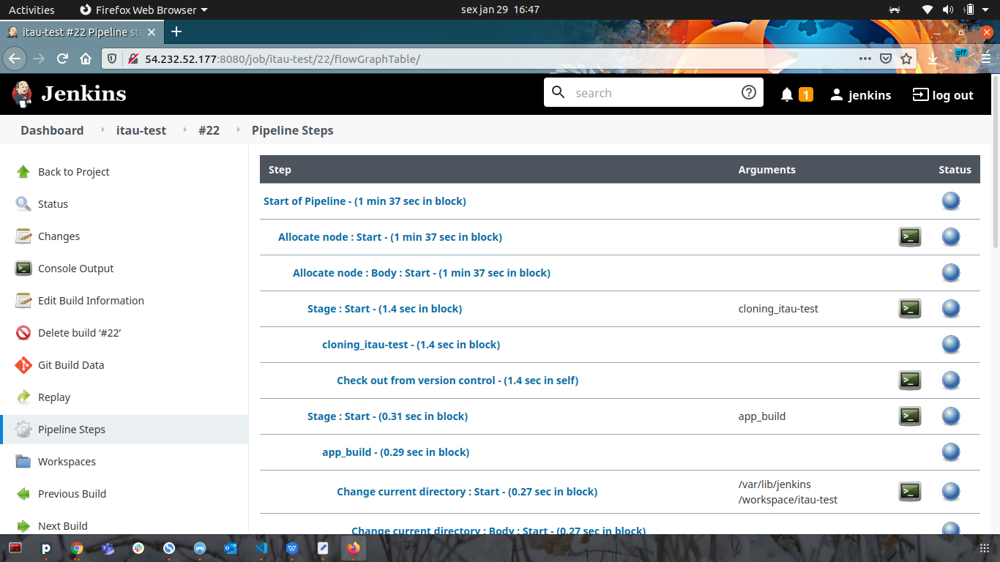
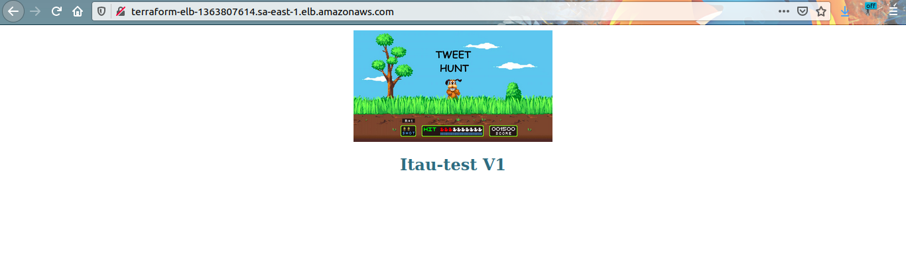
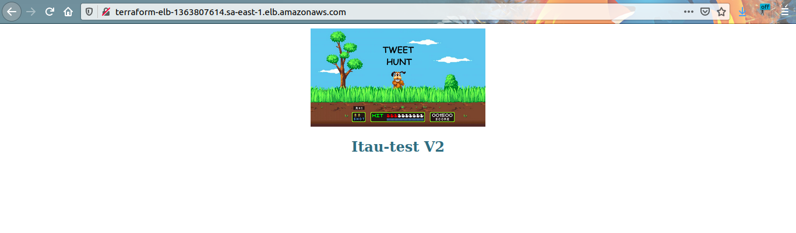
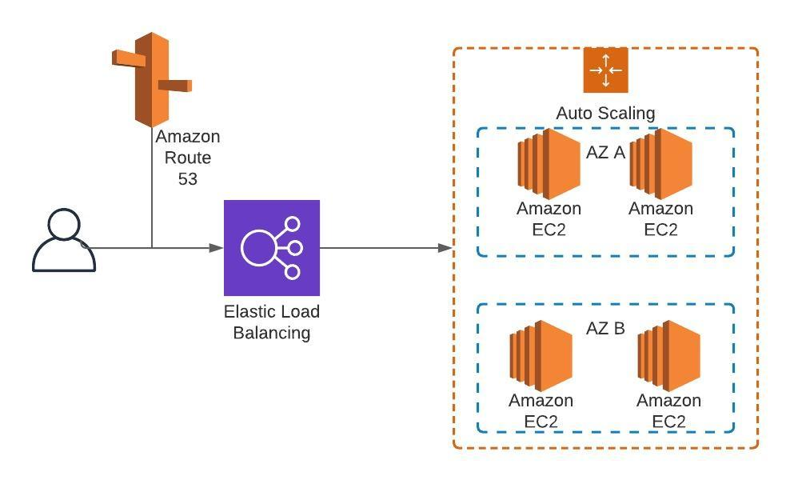

# itau-test

Projeto para criação de stack de aplicação feita usando infra como código (terraform) e pipeline para deploy usando Jenkins

## Setup da stack
```
Executar no jenkins a pipeline encontrada em <jenkins/Jenkinsfile. 
A pipeline para o Jenkins vai executar toda a criação da infraestrutura na AWS, e atualizar as alterações da aplicação.
```
## Descrição da stack
```
Foi utilizado o terraform para o provisionamento de todos componentes de infraestrutura na AWS.
Ao executar o job do Jenkins, serão criadas novas instancias EC2 e após o término as antigas são substituidas em forma de rollout.
```
## Escalabilidade
```
Está configurado uma politica de scale up/down baseado na utilização de recursos de CPU de cada instancia, aumentando a disponibilidade e redusindo os custos quando houver pouca utilização.
```
## Pipeline de deploy
<p align="center">
	
</p>

## Versão 1 da aplicação:
<p align="center">
	
</p>

## Versão 2 da aplicação:
<p align="center">
	
</p>

## Desenho da estrutura:
<p align="center">
	
</p>

